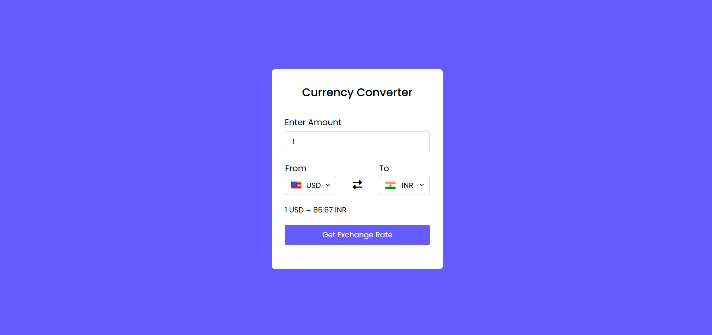

# Forex Flow

Forex Flow is a web application that allows users to convert currencies using real-time exchange rates. The application provides a user-friendly interface to select currencies and input amounts for conversion.



## Features

- Real-time currency conversion
- Dynamic country and currency selection
- Swap functionality to quickly switch between currencies
- Responsive design for mobile and desktop

## Installation

1. Clone the repository:
    ```sh
    git clone https://github.com/yourusername/forex-flow.git
    ```
2. Navigate to the project directory:
    ```sh
    cd forex-flow
    ```
3. Install the dependencies:
    ```sh
    npm install
    ```

## Usage

1. Start the development server:
    ```sh
    npm run dev
    ```
2. Open your browser and navigate to `http://localhost:3000`.

## Technologies Used

- HTML
- CSS
- JavaScript
- Vite
- Exchange Rate API.

## Acknowledgements

- [Exchange Rate API](https://www.exchangerate-api.com/)
- [Font Awesome](https://fontawesome.com/)
- [Flags API](https://flagsapi.com/)
